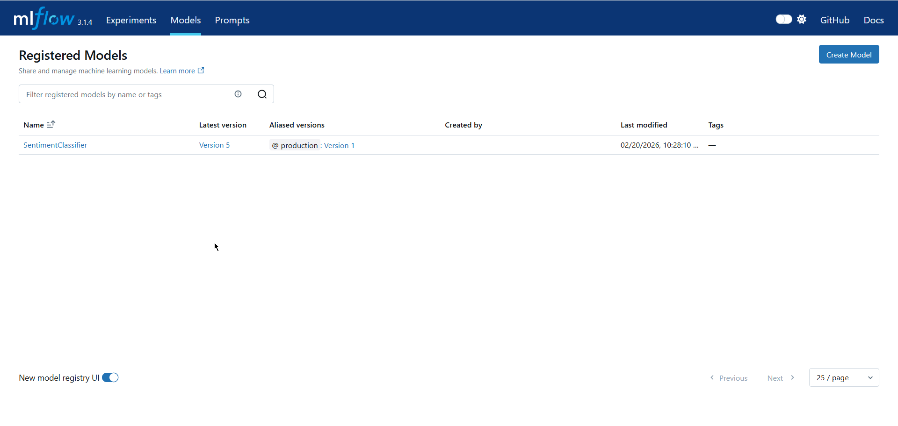
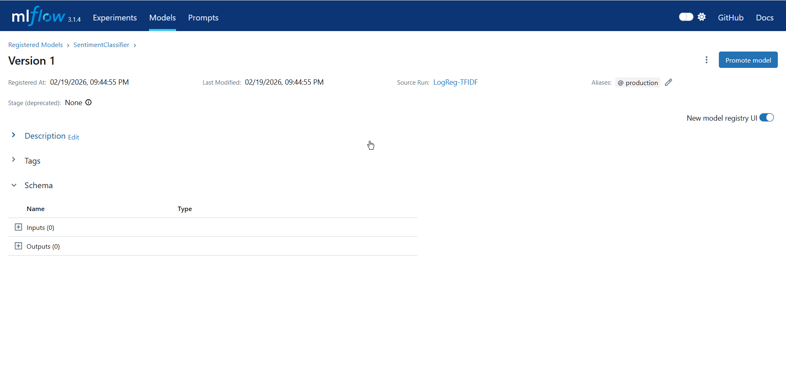

# Sentiment Analysis MLOps Service

A production-ready sentiment analysis inference service that demonstrates modern MLOps practices using MLflow for experiment tracking and model registry management, combined with FastAPI for building a scalable REST API.

## 🎯 Overview

This project implements a complete MLOps workflow for sentiment analysis:

1. **Data Processing**: Load and preprocess IMDb movie reviews
2. **Model Training**: Train a Logistic Regression model with TF-IDF vectorization
3. **Experiment Tracking**: Log all experiments to MLflow for reproducibility
4. **Model Registry**: Manage model versions and lifecycle stages
5. **API Service**: Serve predictions via a FastAPI REST endpoint
6. **Containerization**: Deploy using Docker and Docker Compose

### Key Features

- ✅ **MLflow Integration**: Complete experiment tracking and model registry management
- ✅ **FastAPI Inference**: High-performance REST API with input validation
- ✅ **Docker Compose**: Orchestrate MLflow server and API service
- ✅ **Comprehensive Testing**: Unit and integration tests with pytest
- ✅ **Production Ready**: Error handling, logging, health checks
- ✅ **Reproducible**: Fixed random seeds and pinned dependencies

## 📁 Project Structure

```
sentiment-mlops-service/
├── app/
│   ├── __init__.py
│   ├── main.py                 # FastAPI application
│   └── utils/
│       ├── __init__.py
│       └── preprocess.py        # Text preprocessing utilities
├── tests/
│   ├── __init__.py
│   ├── test_preprocess.py       # Unit tests for preprocessing
│   └── test_api.py              # Integration tests for API
├── train.py                     # Model training script with MLflow
├── requirements.txt             # Python dependencies
├── Dockerfile                   # Docker image definition
├── docker-compose.yml           # Multi-container orchestration
├── .env.example                 # Environment variable template
├── README.md                    # This file
└── IMDB Dataset.csv            # Dataset (download from Kaggle)
```

## 📦 Prerequisites

- **Docker** (version 20.10+)
- **Docker Compose** (version 1.29+)
- **Python 3.9+** (for local development)
- **Git**

### Dataset

Download the IMDb Movie Review dataset from [Kaggle](https://www.kaggle.com/datasets/lakshmi25npathi/imdb-dataset-of-50k-movie-reviews):

1. Download `IMDB Dataset.csv`
2. Place it in the root directory of the project

## 🚀 Quick Start

The easiest way to get started is using Docker Compose:

```bash
# Clone the repository
git clone https://github.com/Dhanasirikoppisetti/sentiment-analysis
cd sentiment-mlops-service

# Build and start services
docker-compose up --build

# Check service health
curl http://localhost:8000/health

# Access MLflow UI
# Open browser: http://localhost:5000
```

## 🔧 Setup Instructions

### Option 1: Using Docker Compose (Recommended)

#### 1. Build and Start Services

```bash
docker-compose up --build
```

This starts:
- **MLflow Server**: http://localhost:5000 (Experiment tracking & model registry)
- **FastAPI Application**: http://localhost:8000 (Sentiment inference API)

# Sentiment Analysis MLOps Service

A production-ready Sentiment Analysis API built using MLflow Model Registry, FastAPI, and Docker.

This project demonstrates an end-to-end MLOps workflow — from model training and experiment tracking to model versioning and API deployment.

## 📌 Project Overview

This system performs sentiment analysis on movie reviews (positive/negative) using:

- TF-IDF Vectorization
- Logistic Regression
- MLflow for experiment tracking & model registry
- FastAPI for inference API
- Docker Compose for orchestration

The model is trained on the IMDb Movie Review dataset and served through a REST API.

## 🏗️ Architecture

Client → FastAPI → MLflow Model Registry → Trained Model

- Model is registered in MLflow
- Production version is automatically loaded by API
- Docker Compose runs both services together

## 🛠️ Tech Stack

- Python 3.9+
- FastAPI
- MLflow
- Scikit-learn
- Docker & Docker Compose
- Pytest

## 📂 Project Structure

```text
sentiment-mlops-service/
│
├── app/                # FastAPI application
├── tests/              # Unit & API tests
├── train.py            # Model training script
├── Dockerfile
├── docker-compose.yml
├── requirements.txt
└── README.md
```

## ⚙️ How to Run (Docker – Recommended)

### 1️⃣ Build and Start Services

```bash
docker-compose up --build
```

This starts:

- MLflow UI → http://localhost:5000
- API Server → http://localhost:8000

### 2️⃣ Train the Model

```bash
docker-compose exec fastapi-app python train.py
```

This will:

- Train the model
- Log metrics to MLflow
- Register the model
- Promote best model to Production

### 3️⃣ Test the API

Open:

http://localhost:8000/docs

Swagger UI will appear.

## 🔌 API Endpoints

### Health Check

GET /health

### Model Info

GET /info

### Predict Sentiment

POST /predict

Request:

```json
{
  "text": "This movie was amazing!"
}
```

Response:

```json
{
  "sentiment": "positive",
  "confidence": 0.93
}
```

## 🧪 Running Tests

```bash
docker-compose exec fastapi-app pytest tests/ -v
```

## 📸 Screenshots

### MLflow Experiments


### Model Registry


### Model Version (Production)


### FastAPI Swagger UI


## 📊 Model Performance

- Accuracy: ~89–90%
- F1 Score: ~89%
- Inference Time: <100ms

## 💡 Key MLOps Concepts Demonstrated

- Experiment tracking using MLflow
- Model versioning & stage transitions
- Production model loading from registry
- API validation & error handling
- Dockerized multi-service deployment

## 🎯 Why This Project?

This project focuses on demonstrating MLOps best practices, not model complexity.
It shows how to manage the full lifecycle of a machine learning model in a production-like environment.

## 👩‍💻 Author

Built as part of an academic MLOps evaluation project.

Version: 1.0.0  
Last Updated: February 2026
  "mlflow_tracking_uri": "http://mlflow-server:5000",
