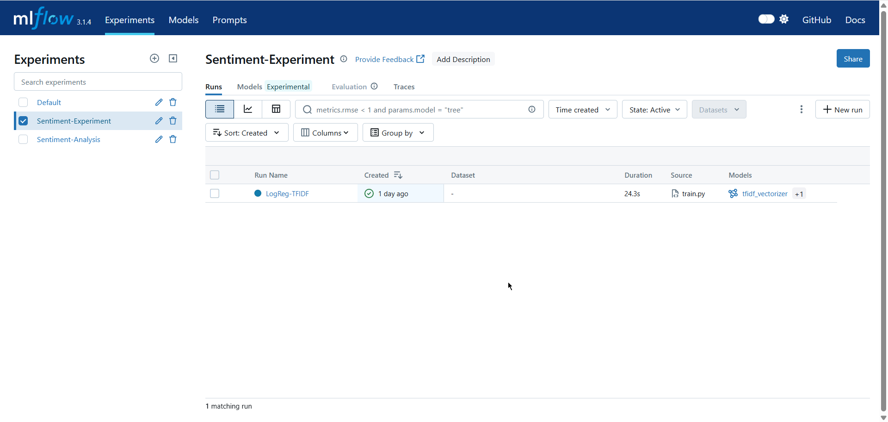

# Sentiment Analysis MLOps Service

A production-ready sentiment analysis API built using MLflow Model Registry, FastAPI, and Docker.

This project demonstrates an end-to-end MLOps workflow — from model training and experiment tracking to model versioning and API deployment.

## 📌 Project Overview

This system performs sentiment analysis on movie reviews (positive/negative) using:

- TF-IDF Vectorization
- Logistic Regression
- MLflow for experiment tracking & model registry
- FastAPI for inference API
- Docker Compose for orchestration

The model is trained on the IMDb Movie Review dataset and served through a REST API.

## 🏗️ Architecture

`Client → FastAPI → MLflow Model Registry → Trained Model`

- Model is registered in MLflow
- Production version is automatically loaded by API
- Docker Compose runs both services together

## 🛠️ Tech Stack

- Python 3.9+
- FastAPI
- MLflow
- Scikit-learn
- Docker & Docker Compose
- Pytest

## 📂 Project Structure

```text
sentiment-mlops-service/
│
├── app/                # FastAPI application
├── tests/              # Unit & API tests
├── train.py            # Model training script
├── Dockerfile
├── docker-compose.yml
├── requirements.txt
└── README.md
```

## ⚙️ How to Run (Docker Recommended)

### 1️⃣ Build and Start Services

```bash
docker-compose up --build
```

This starts:

- MLflow UI → http://localhost:5000
- API Server → http://localhost:8000

### 2️⃣ Train the Model

```bash
docker-compose exec fastapi-app python train.py
```

This will:

- Train the model
- Log metrics to MLflow
- Register the model
- Promote best model to Production

### 3️⃣ Test the API

Open http://localhost:8000/docs to view Swagger UI.

## 🔌 API Endpoints

### Health Check

- `GET /health`

### Model Info

- `GET /info`

### Predict Sentiment

- `POST /predict`

Request:

```json
{
  "text": "This movie was amazing!"
}
```

Response:

```json
{
  "sentiment": "positive",
  "confidence": 0.93
}
```

## 🧪 Running Tests

```bash
docker-compose exec fastapi-app pytest tests/ -v
```

## 📸 Screenshots

### MLflow Experiments


### Model Registry


### Model Version (Production)


### FastAPI Swagger UI


## 📊 Model Performance

- Accuracy: ~89–90%
- F1 Score: ~89%
- Inference Time: <100ms

## 💡 Key MLOps Concepts Demonstrated

- Experiment tracking using MLflow
- Model versioning & stage transitions
- Production model loading from registry
- API validation & error handling
- Dockerized multi-service deployment

## 🎯 Why This Project?

This project focuses on demonstrating MLOps best practices, not model complexity.
It shows how to manage the full lifecycle of a machine learning model in a production-like environment.

## 👩‍💻 Author

Built as part of an academic MLOps evaluation project.

Version: 1.0.0  
Last Updated: February 2026

## 🎥 Demo Video

[Watch the project demo on YouTube](https://youtu.be/Sudub3DJ8Gs)

[](https://youtu.be/Sudub3DJ8Gs)
